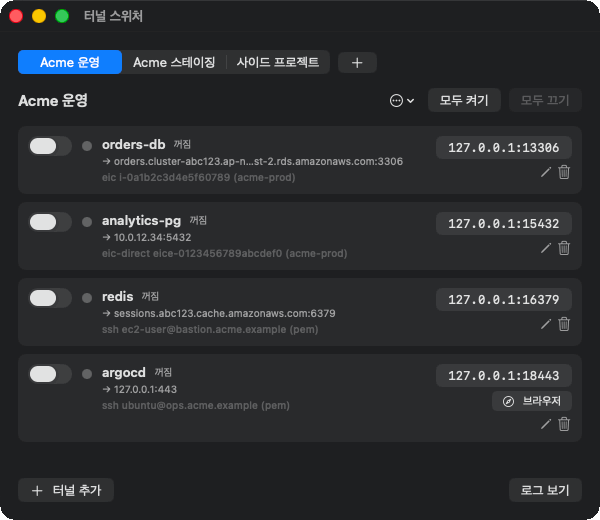
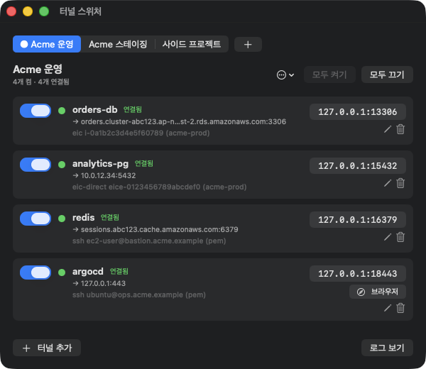
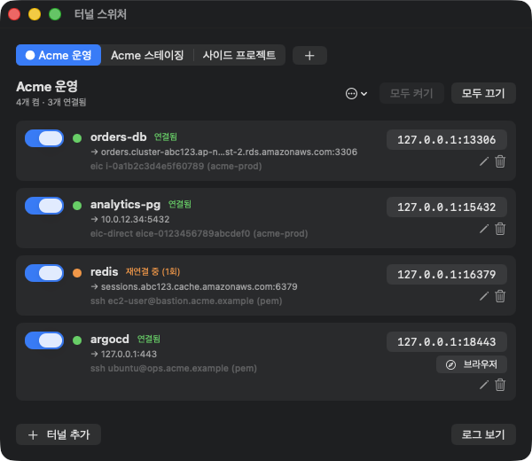

# 터널 스위처 (TunnelSwitch)

배스천 뒤에 있는 RDS·Redis, 사내 ArgoCD·Jenkins 같은 걸 `localhost` 로 붙여 주는 macOS 앱. 메뉴바에서 바로 켜고 끈다.


`ssh -L ...` 이나 `aws ec2-instance-connect open-tunnel ...` 을 매번 치는 대신, 터널을 한 번 등록해 두고 스위치로 켜고 끈다.
터널은 그룹(예: 회사·AWS 계정별)으로 묶고, 하나씩 또는 그룹 단위로 켠다. 한 번에 한 그룹만 켜지고,
다른 그룹의 터널을 켜면 기존 그룹은 꺼진다. 그래서 그룹끼리는 로컬 포트가 겹쳐도 된다.

켜진 터널은 백그라운드 데몬이 유지한다. 끊기면 다시 연결하고, 앱을 꺼도 터널은 그대로 살아 있다.
켜진 터널의 설정을 바꾸면 그 터널만 다시 연결된다.

## 화면

메인 창. 모두 켜기 → 연결 → `redis` 가 끊겼다가 다시 붙는 과정이다.



| 연결됨 | 끊겨서 재연결 중 |
|---|---|
|  |  |

화면에 나오는 서버 주소와 인스턴스 ID 는 예시 값이다.

- 메뉴바에는 켜진 그룹 이름이 보이고, 아직 연결 안 된 터널이 있으면 아이콘이 ⚠︎ 로 바뀐다
- 끊기면 ssh 가 마지막으로 남긴 메시지를 터널 아래에 보여 준다
- 웹 서비스 터널은 "브라우저" 버튼을 누르면 터널을 켜고 연결될 때까지 기다렸다가 연다
- 같은 기능을 터미널에서 `tunsw` 명령으로도 쓸 수 있다 ([CLI](#cli))

## 요구 사항

- macOS 14 이상
- Xcode Command Line Tools (`xcode-select --install`) — Swift 빌드, `python3`, `ssh` 포함
- AWS CLI v2 — EIC 방식을 쓸 때. 터널에 지정하는 AWS 프로파일은 각자의 `~/.aws` 설정을 쓴다

## 설치 / 실행

```bash
git clone https://github.com/Darren4641/tunnelswitch.git
cd tunnelswitch
./scripts/install.sh
```

빌드해서 `~/Applications/TunnelSwitch.app` 에 설치하고 실행한다. 이후에는 Launchpad·Spotlight 에서 "TunnelSwitch"(터널 스위처)로 연다.
터미널용 `tunsw` 명령도 `~/.local/bin/tunsw` 에 링크된다 (예전 이름 `dbtun` 도 같은 명령으로 링크된다).

예전 이름(DB 터널)에서 올라오는 경우 `install.sh` 가 `DBTunnel.app` 을 지우고, 엔진을 처음 실행할 때
`~/.config/dbtunnel` 을 `~/.config/tunnelswitch` 로 옮긴다. 켜져 있던 터널은 새 데몬으로 다시 켜진다.

## 구성

| 경로 | 역할 |
|---|---|
| `engine/tunsw` | 터널 엔진 (Python 표준 라이브러리). 설정 저장, 데몬, 재연결 |
| `Sources/TunnelSwitch/` | SwiftUI 앱. 엔진을 호출해 화면에 보여준다 |
| `scripts/install.sh` | 빌드 + 앱 번들 생성 + 설치 |
| `scripts/make-icon.swift` | 앱 아이콘을 코드로 그린다. `install.sh` 가 호출한다 |

앱 번들에는 `engine/tunsw` 사본이 `Contents/Resources/` 로 들어간다. 엔진을 고치면 `install.sh` 를 다시 실행한다.

## 터널 방식

| 방식 | 경로 |
|---|---|
| EIC → 배스천 | EIC Endpoint 로 배스천 EC2 에 SSH → RDS 로 `-L` 포워딩 |
| SSH(pem) → 배스천 | pem 키로 공인 배스천에 SSH → RDS 로 `-L` 포워딩 |
| EIC 직접 | `aws ec2-instance-connect open-tunnel --private-ip-address` |
| 웹 서비스 | SSH 서버에 접속 → 웹 서비스(기본 `127.0.0.1`, 즉 SSH 서버 자신)로 `-L` 포워딩. 브라우저로 `http(s)://localhost:<로컬 포트>` 를 연다 |

SSH(pem)·웹 서비스 방식은 **pem 키** 또는 **비밀번호**로 인증한다. 비밀번호는 `config.json`(권한 600)에
저장되고, 연결할 때 `SSH_ASKPASS` 로 ssh 에 넘긴다 (OpenSSH 8.4 이상). 비밀번호가 틀리면 한 번만 시도하고 끊은 뒤
백오프하며 다시 시도한다.

웹 서비스 터널은 목록의 "브라우저" 버튼(또는 `tunsw open`)으로 연다. 꺼져 있으면 켜고 연결될 때까지 기다린 뒤 연다.

EIC 방식은 전용 SSH 키(`~/.config/tunnelswitch/eic_ed25519`)를 만들어 연결할 때마다
`send-ssh-public-key` 로 배스천에 올린다. 필요한 권한은 `ec2-instance-connect:SendSSHPublicKey`,
`ec2-instance-connect:OpenTunnel` 이고, EIC Endpoint ID 를 비워 두면 `ec2:DescribeInstanceConnectEndpoints` 도 필요하다.

## 데이터 위치

`~/.config/tunnelswitch/` (환경변수 `TUNSW_HOME` 으로 바꿀 수 있다)

- `config.json` — 등록한 터널 (권한 600)
- `daemon.log` — 연결 로그 (5MB 넘으면 시작할 때 `.log.1` 로 교체)
- `desired.json` — 켜져 있어야 할 터널 목록. 데몬이 1초마다 읽어 실제 상태를 맞춘다
- `daemon.pid`, `status.json` — 실행 상태
- `askpass.sh` — 비밀번호 인증용 `SSH_ASKPASS` 스크립트 (비밀번호는 담지 않고 환경변수에서 읽는다)

## CLI

```bash
tunsw on  <group> [name ...]    # 켜기 (이름 생략 시 그룹 전체). 다른 그룹은 꺼짐
tunsw off <group> [name ...]    # 끄기 (이름 생략 시 그룹 전체)
tunsw open <group> <name>       # 웹 서비스 터널을 브라우저로 열기 (꺼져 있으면 켬)
tunsw status | stop | restart | logs -f
tunsw add | list | remove <group> <name> | edit
tunsw group-add <이름> | group-rename <group> <새 이름> | group-remove <group> [--force]
```

## 라이선스

[MIT](LICENSE)
